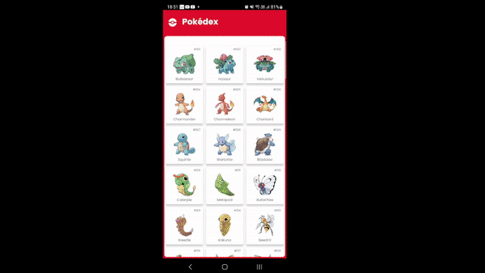

<h2 align="center"> 
	🚧  Desafio Técnico Snapfi - Completo 🚀 🚧
</h2>

## Visão Geral

O Projeto Pokedex é uma aplicação móvel que permite aos usuários pesquisar e visualizar informações detalhadas sobre os diferentes tipos de Pokemon. A aplicação é desenvolvida usando o Flutter e Dart, e segue a Arquitetura Limpa (Clean Architecture) para organização de código e estrutura do projeto.

## Layout Mobile

<table>
  <tr>
    <td>Tela inicial</td>
  </tr>
  <tr>
    <td></td>
  </tr>
   <tr>
    <td>Tela de Detalhes</td>
  </tr>
   <tr>
    <td></td>
  </tr>
 </table>

## [Requisitos](https://github.com/snapfi/mobile-code-challenge)

**Sistema Operacional:** Windows, MacOS, Linux

**Ferramentas:**
- Flutter SDK
- Dart SDK
- Editor de código (Recomendado: VS Code ou Android Studio)
- Emulador Android/iOS ou dispositivo físico para testes

**Conhecimento Requerido:**
- Dart (linguagem de programação)
- Flutter (framework)
- Clean Architecture
- Gerenciamento de estado com MobX
- Conhecimento em API RESTful

**Dependências do Projeto:**
- get_it: Para injeção de dependência
- mobx e flutter_mobx: Para gerenciamento de estado
- google_fonts: Para tipografia personalizada
- flutter_svg: Para renderização de imagens SVG
- http: Para fazer solicitações de rede
- shimmer: Para efeito de carregamento
- flutter_animate: Para animações
- cached_network_image: Para carregar e armazenar em cache imagens da rede
- flutter_native_splash e flutter_launcher_icons: Para personalizar o ícone e a tela de inicialização do aplicativo
- build_runner e mobx_codegen: Para geração de código

## Configuração do Ambiente de Desenvolvimento

1. Instale o Flutter SDK e o Dart SDK no seu sistema operacional.
2. Instale um editor de código de sua preferência.
3. Configure o emulador ou dispositivo físico para testes.

## Estrutura do Projeto (Clean Architecture)

O projeto é estruturado de acordo com os princípios da Arquitetura Limpa. Essa estrutura proporciona um desacoplamento do código e facilita a manutenção e testes.

~~~Dart
/pokedex
  /lib
    /core
      /components
      /routes
      /utils
    /src
      /pokedex
        /data
          /repositories
        /domain
          /models
          /repositories
          /usecases
        /presentation
          /components
          /provider
          /screens
          /utils
    main.dart
  /test
  pubspec.yaml
~~~

- **core**: Este diretório contém código que pode ser compartilhado entre vários recursos. Normalmente inclui utilitários, constantes, erros e definições de casos de uso.
- **src**: Este diretório contém todos os recursos separados do aplicativo. Cada recurso é dividido em três camadas - Apresentação, Domínio e Dados.
- **data**: Esta camada lida com fontes de dados e a implementação do repositório.
- **domain**: Esta camada contém as entidades e regras de negócio da aplicação.
- **presentation**: Esta camada lida com a interface do usuário e a lógica de apresentação da aplicação.
- **main.dart**: O ponto de entrada da aplicação.

## Como Usar

1. Clone o repositório do projeto.
2. Navegue até o diretório do projeto e execute `flutter pub get` para instalar as dependências.
3. Inicie o emulador ou conecte o dispositivo físico.
4. Execute `flutter run` para iniciar a aplicação.

## Futuras Melhorias

1. Implementar o recurso de favoritos.
2. Adicionar suporte para várias línguas.
3. Implementar uma função de busca mais avançada.

## Conclusão

Este projeto demonstra uma aplicação Flutter que interage com a API de Pokemon e adota a Arquitetura Limpa. Ele cobre conceitos importantes como gerenciamento de estado com MobX, injeção de dependência com GetIt, personalização de fontes com Google Fonts, renderização de SVGs com Flutter SVG, solicitações de rede com HTTP, efeitos de carregamento com Shimmer, animações com Flutter Animate, cache de imagens com CachedNetworkImage, personalização de ícones e tela de inicialização com Flutter Native Splash e Flutter Launcher Icons e geração de código com Build Runner e MobX Codegen.

## Referências

- [Documentação do Flutter](https://flutter.dev/docs)
- [API de Pokemon](https://pokeapi.co/)

## Contato

Para quaisquer dúvidas ou sugestões, por favor entre em contato com [email](luandantasandrade@gmail.com).
